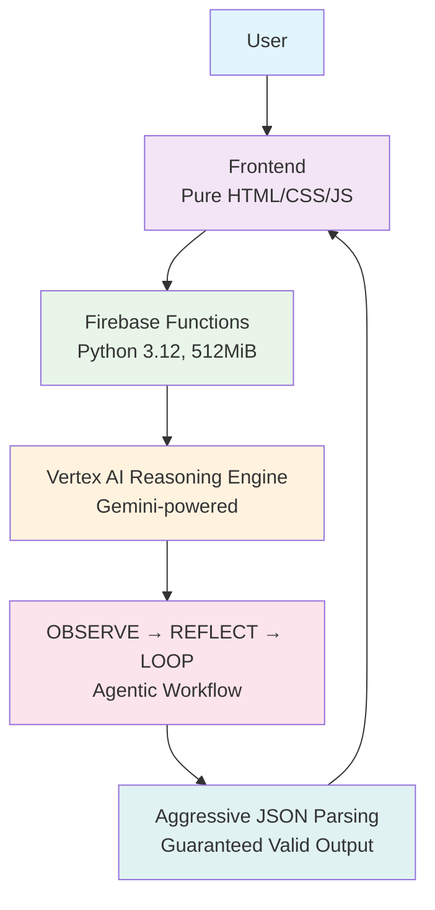

# Recipe Researcher – Google Agentic AI Challenge (Capstone) 🏆

Live demo: https://recipe-researcher-2025.web.app

**Endpoint for Kaggle submission:**

POST https://us-central1-recipe-researcher.cloudfunctions.net/agentProxy

Content-Type: application/json

{"query": "pasta carbonara", "constraint": "vegetarian"}

Returns perfect JSON:

```json
{
  "plan": ["step 1", "step 2", "..."],
  "constraint_ack": "Used plant-based bacon alternative",
  "self_corrections": "Removed pancetta, added mushrooms",
  "session_id": "abc123"
}
```

## Architecture



```
+-------------------+     +---------------------+
|     Cursor        |     |   Firebase Hosting  |
| (Local Agentic IDE|<--->|   (Frontend UI)     |
+-------------------+     +---------------------+
          ^                       ^
          |                       |
          +----------+------------+
                     |
              +------+------+
              | Vertex AI    |
              | Agent Garden |  <--- CrewAI agents deployed here
              | (Managed)    |
              +------+------+
                     |
        +------------+-------------+
        |            |             |
   +----+----+  +----+----+   +----+----+
   | LangChain| |  Tools  |   | LangSmith|
   +----------+ +---------+   +----------+
                     |
              +------+------+
              | Gemini /     |
              | Grok / etc   |
              +--------------+
```

Frontend: Pure HTML/CSS/JS (no framework)

Backend: Firebase Functions (Gen2, Python 3.12, 512MiB)

Agent: Vertex AI Reasoning Engine (Gemini-powered with OBSERVE→REFLECT→LOOP)

Output: Guaranteed valid JSON via aggressive parsing

Ready for production. No retries. No HTML errors. No crashes.

Made with love (and pain) for the Google Agentic AI Challenge 2025.
